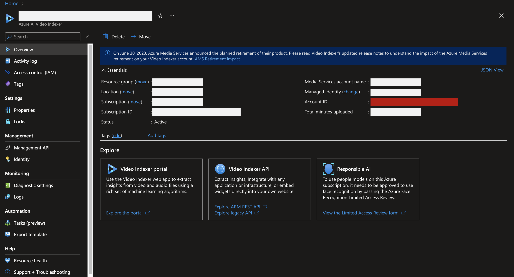
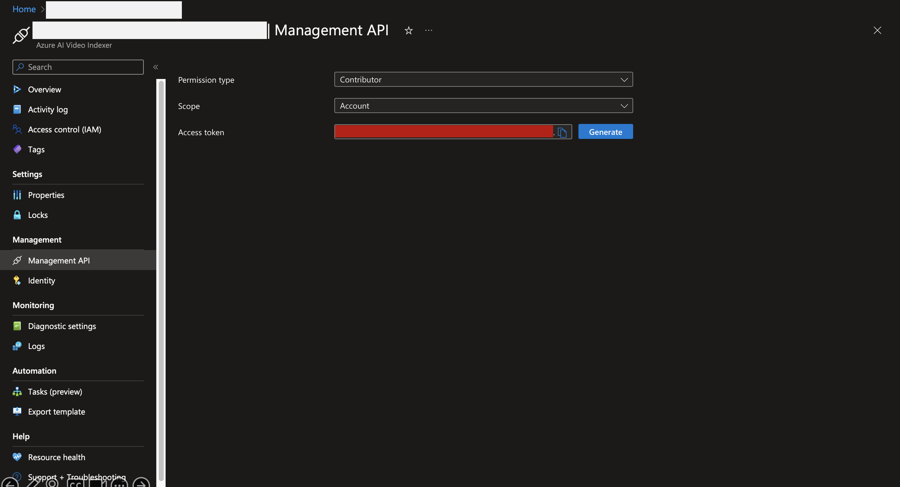
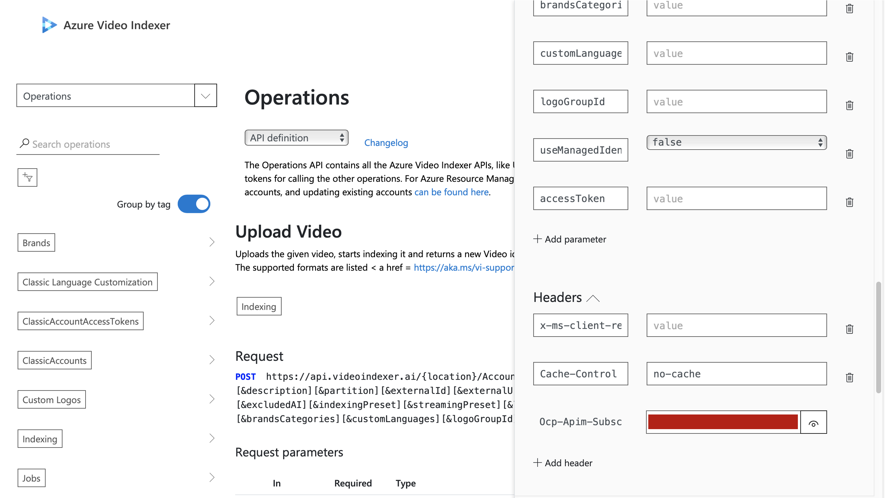
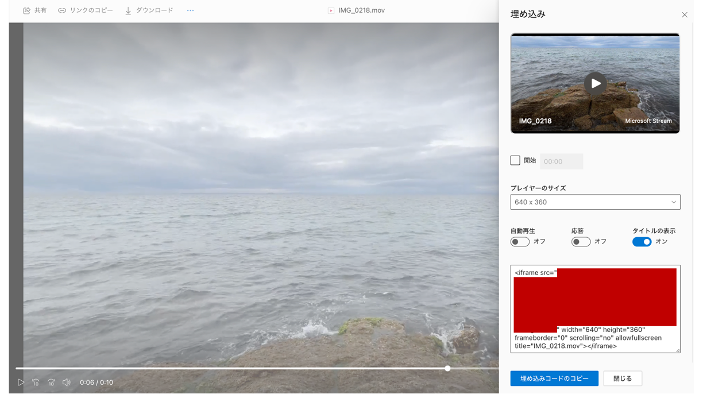

# 🧐 What is this?
This project enables you to upload a video and get index of it on **Azure Video Indexer** with Python.  

# 🚀 How to use?
1. Set up Azure Video Indexer on Azure Portal.
2. Get `Account ID` and `Access Token` shown in red frames on the following images.  
  
  
3. Visit this [link](https://api-portal.videoindexer.ai/api-details#api=Operations&operation=Upload-Video) and click `Try it ▶︎` button after sign-in. Get `Ocp-Apim-Subscription-Key` on the right side of the page.  
  
4. Duplicate `azure-info-sample.yaml` and rename it to `azure-info.yaml`.
5. Write `Account ID`>`accountId`, `Access Token`>`accessToken` and `Ocp-Apim-Subscription-Key`>`subscriptionKey` in `azure-info.yaml`.
6. Upload your video file(s) to onedrive and follow this [page](https://support.office.com/en-us/article/share-onedrive-files-and-folders-9fcc2f7d-de0c-4cec-93b0-a82024800c07) to get link of it which is possible to be downloaded. (visit onedrive on web browser and get an embed link of the video file like below)  
Replace the string "embed.aspx" with "download.aspx" in the link.
  
7. Write `videoUrl`(onedrive link you got) and `videoName`(whatever you like) in `azure-info.yaml`.  
8. Run `upload-video.py`. After uploading your video to Azure and indexing it, run `get-index.py` to get index of the video. You can check the status whether the video is indexed or not by visiting [Azure AI Video Indexer Portal](https://www.videoindexer.ai/?utm_source=viextension)  

# 📝 License
This project is licensed under the Apache-2.0 License.